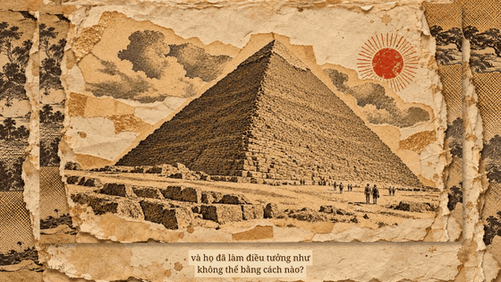

# Phim nháp kim tự tháp — 4 phút

**Đã có [bản phim ghép giọng đọc tiếng Việt](../voice/README.md)** · [Tải MP3 giọng đọc](../voice/loi-doc-tieng-viet-4-phut.mp3).

[Xem phim nháp 4 phút](phim-nhap-4-phut.mp4) · [Xem nhanh 36 giây](xem-nhanh-36-giay.mp4) · [Ảnh đại diện](poster.png) · [Phụ đề SRT](phu-de-film-nhap.srt)

Bản nháp ghép đủ **20 cảnh, mỗi cảnh 12 giây**, có phụ đề tiếng Việt. Video hiện ở **720p, chưa có giọng đọc, nhạc hay âm thanh**.

20 trang ảnh chuyển động bằng nhịp trượt, xoay và xếp lớp trên nền giấy dó. Có thể xem thêm [mẫu cảnh 09 với các miếng giấy tách lớp](../../collage/README.md).

## Dựng tiếp

1. Xem bản nháp để kiểm tra thứ tự cảnh, nhịp kể và phụ đề.
2. Trong CapCut, thu giọng tiếng Việt hoặc dùng Text to speech với [lời dẫn đầy đủ](../../loi-dan.txt); căn lại cảnh và phụ đề theo bản đọc.
3. Thêm nhạc nền nhỏ cùng tiếng giấy lật/xé nhẹ. Có thể dựng lại từ [20 ảnh gốc](../README.md) và xuất bản hoàn chỉnh ở 1080p.

[Phong cách giấy cắt dán](../phong-cach.md)
