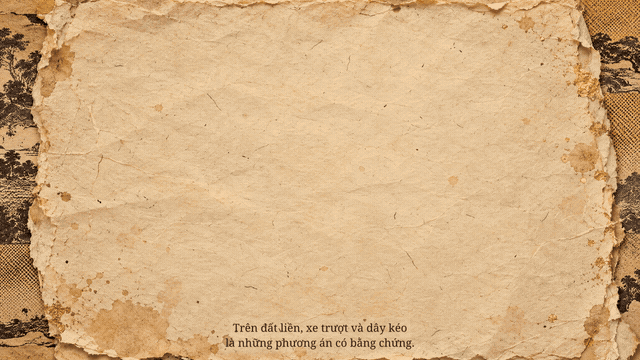

# Mẫu phim tài liệu collage giấy — cảnh 09

[Tải video MP4](./preview/09-collage-motion-12s.mp4) · [Mở GIF](./preview/09-collage-motion-12s.gif) · [Phụ đề cảnh 09](./scene-09.srt)

Đây là **mẫu thử 12 giây** cho cảnh “Sức kéo và xe trượt”, để xem phong cách trước khi dựng tiếp bộ 20 cảnh. Mẫu chưa có âm thanh.

## Phong cách dùng tiếp

Phim tài liệu lịch sử như một cuốn sổ tay: nền giấy dó và giấy báo ố vàng; hình in cổ halftone đen–sepia; điểm vàng son và dấu đỏ son. Các mảng giấy xé chồng lớp, giữ mép giấy và bóng đổ nhẹ. Hình ảnh minh họa bằng AI.

Chuyển động nằm ở từng lớp giấy: mảng kim tự tháp trượt vào từ bên phải, nhóm thợ trượt vào từ bên trái rồi dịch dần về trước; các mảng xoay nhẹ, dấu đỏ hạ xuống với một nhịp nảy ngắn. Giữ cảm giác lật xem tư liệu, tránh chuyển động quá mạnh làm khó đọc hình và phụ đề.

## Các lớp PNG

| Tệp | Công dụng |
| --- | --- |
| [background-paper.png](./assets/background-paper.png) | Nền giấy cũ, màu vàng ấm và chất liệu cho toàn cảnh. |
| [pyramid-cutout.png](./assets/pyramid-cutout.png) | Mảng giấy xé về kim tự tháp, tạo lớp cảnh phía sau. |
| [workers-cutout.png](./assets/workers-cutout.png) | Mảng tiền cảnh với người thợ kéo xe trượt, thể hiện chủ đề cảnh 09. |
| [stamp-cutout.png](./assets/stamp-cutout.png) | Dấu đỏ son tạo điểm nhấn trong bố cục. |

Dấu đỏ là **đồ họa trang trí hiện đại**, không phải dấu hoặc hiện vật Ai Cập cổ đại. Các mảng giấy và cảnh tái dựng dùng để minh họa câu chuyện, không thay thế tư liệu khảo cổ.
